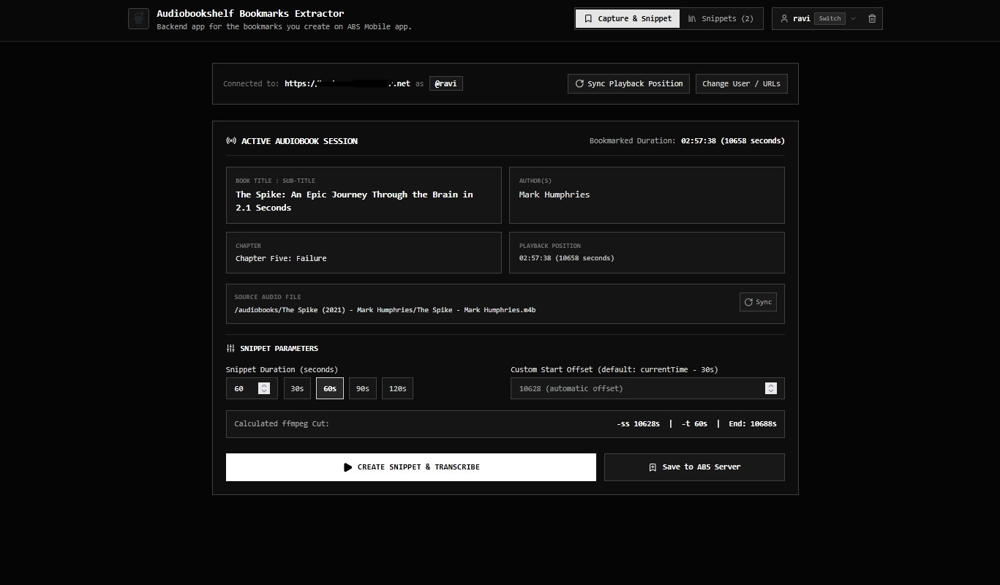

# Audiobookshelf Bookmarks Extractor

**Version 1.0**  
Automated bookmark audio extractor, Whisper speech-to-text transcriber, and web dashboard for [Audiobookshelf](https://www.audiobookshelf.org/).

---

## What It Does

Audiobookshelf Bookmarks Extractor automatically extracts audio clips corresponding to your bookmarks or listening positions in Audiobookshelf, transcribes them into searchable markdown notes using AI speech recognition (`faster-whisper` or `Vosk`), and neatly organizes the resulting `.mp3`, `.md`, and `.json` files per user (`{VOLUME_DIR}/{username}/bookmarks/{book_title}/`).

### Key Features at a Glance

- 🎧 **Works with Official ABS Apps**: Zero companion apps or modified APKs required. Keep using the official Audiobookshelf mobile apps (iOS & Android) and web client.
- ⚡ **Transparent Event Interceptor**: Acts as an ultra-fast reverse proxy that intercepts bookmark taps (`POST /api/me/item/:id/bookmark`), replies instantly to your phone (<50ms), and extracts audio in the background.
- 🎙️ **AI Speech-to-Text Transcription**: Powered by `faster-whisper` with automatic background model pre-warming on startup to prevent cold-start delays, plus lightweight `Vosk` fallback.
- 📁 **Direct Local Slicing & Docker Path Mapping**: Uses `ffmpeg` to slice lossless audio clips directly from source `.m4b`/`.mp3` files, with `PATH_MAPPINGS` support for translating ABS container paths to host paths.
- 📝 **PKM-Ready Structured Markdown**: Formats each transcript with YAML frontmatter (title, author, chapter, timestamp, bookmarked duration) and markdown headers, ready to drop into Obsidian, Logseq, or Notion.
- 🌐 **Web Dashboard & Audio Player**: Browse, search, filter, and play audio snippets with native waveform seeking (HTTP 206 partial content) and view transcripts from any browser.
- 🔒 **Zero-Disk Credential Security**: In-memory ephemeral encryption (AES-256) ensures API keys and passwords are never persisted to disk, cookies, or browser databases.

### No Companion App Required — Works with Official Audiobookshelf Clients

**You do not need a custom or companion mobile app.** The extractor operates as a **transparent reverse proxy** sitting directly in front of Audiobookshelf:
- You and your users continue using the **official Audiobookshelf mobile apps (iOS & Android)** and the official web player as you always have.
- When you tap **Bookmark** in the official app, the sidecar intercepts the API call, forwards it instantly to Audiobookshelf (with zero delay to your playback), and automatically extracts the 60-second audio snippet and generates an AI transcript in the background.
- It also includes a responsive **Web Dashboard** (`port 13379`) to browse, search, listen to, and copy transcripts of all your captured bookmarks.

---

> ⚠️ **CRITICAL SETUP STEP FOR SERVER ADMINISTRATORS**
>
> To enable automated interception of bookmarks from the official mobile and web apps:
>
> **You MUST change your reverse proxy (Nginx, Caddy, Traefik, NPM, Cloudflare Tunnel) to point to the Sidecar Interceptor Port (`13380`) instead of the Audiobookshelf port (`13378`).**
>
> - **Before (Direct to ABS):** Public Domain `https://abs.example.com` ──► Reverse Proxy ──► Port `13378` (ABS)
> - **After (Intercepted):** Public Domain `https://abs.example.com` ──► Reverse Proxy ──► Port `13380` (Sidecar) ──► Port `13378` (ABS)
>
> The sidecar's `ABS_TARGET_SERVER` setting points internally to your real Audiobookshelf port (`http://localhost:13378`). All regular streaming, browsing, authentication, and sync requests are passed straight through to ABS with zero delay. Only bookmark creation requests are tapped for background extraction.
>
> *(See the [Admin Reverse Proxy Configuration Guide](#admin-reverse-proxy-configuration-guide-changing-the-proxy-destination) below for exact configuration examples).*

---

## Security & Privacy Assurance

- **Zero Persistent Storage**: Your Audiobookshelf credentials, API tokens, and passwords are encrypted in-memory using an ephemeral AES-256 session key.
- **No Disk Storage**: Tokens and secrets are **never** written to `localStorage`, cookies, IndexedDB, or server-side database files.
- **Session-Only Lifetime**: All keys and credentials vanish immediately when you refresh the page, close the browser tab, or click Disconnect.

---

## Share with Your Users

If your users want to use the Web Dashboard to browse and play their extracted bookmarks and transcripts, they can log in using their **API key** (recommended) or their **username and password**.

Here is a simple step-by-step instruction that you can share with your users on how to obtain their API key:

### How to Obtain Your API Key
*(Best done on desktop browser)*

1. Open your Audiobookshelf server URL in your browser and log into your account.
2. Click on your **User Profile / Avatar** icon in the navigation bar.
3. In your account/profile settings, locate the **API Token** section.
4. Click **Generate Token** (or copy your existing token).
5. Copy the generated key and paste it into the **API Key** field in the app.

---

## Screenshots

### Main Screen


### Snippets View


---

## Prerequisites

### General Requirements
- **Audiobookshelf Server** (v2.0+) up and running with audiobooks and bookmarks.
- **Audio Files Access**: Direct local directory access or Docker volume mount to your Audiobookshelf audio files so the extractor can slice segments directly from source files.

### If running via Docker (Recommended)
- **Docker Engine** (v20.10+) and **Docker Compose** (v2.0+).
- *All runtimes, tools (FFmpeg), and speech-to-text models are automatically packaged and pre-configured inside the container.*

### If running directly on host (NPM / PM2)
- **Node.js**: `v18.0.0` or higher (with `npm`).
- **Python**: `v3.10` or higher (with `pip` and `venv`).
- **FFmpeg**: Mandatory system tool for audio slicing, segment extraction, and audio transcription conversion:
  - *Ubuntu / Debian*: `sudo apt-get install -y ffmpeg`
  - *macOS (Homebrew)*: `brew install ffmpeg`
  - *Arch Linux*: `sudo pacman -S ffmpeg`
  - *Fedora / RHEL*: `sudo dnf install -y ffmpeg`

---

## URL, Port & Architecture Guide: Who Is Who?

If you are confused about the multiple URLs and ports used in this project, here is a complete, clear breakdown of the **three distinct services**, what each is called in different places, and what it is used for:

### Quick Reference Matrix

| Service Name | Default Port | Variable Name(s) | UI Label | Example Address in Your Setup | What It Does |
| :--- | :--- | :--- | :--- | :--- | :--- |
| **1. Audiobookshelf (ABS) Server** | **`13378`** *(or 80 / 443)* | `ABS_TARGET_SERVER`<br>`ABS_SERVER_URL` | **"Audiobookshelf Server URL"** | `http://192.168.68.102:13378`<br>`https://abs.example.com` | **Your actual media server (Target only)**. Contains your audiobooks library, accounts, and progress. **The extractor never listens on port 13378; it only connects to it.** |
| **2. Python Sidecar & Interceptor Proxy** | **`13380`** | `SIDECAR_PORT`<br>`PORT: 13380` | *(Configured by Admin)* | `http://192.168.68.102:13380`<br>`https://abs.example.com` (proxied) | **Audio extractor & transparent reverse proxy**. Slices `.mp3` with FFmpeg, runs Whisper speech-to-text, and intercepts official ABS mobile/web bookmark taps (`POST /api/me/item/:id/bookmark`). |
| **3. Web Dashboard & UI Proxy** | **`13379`** | `PORT: 13379` | *(Browser Address Bar)* | `http://192.168.68.102:13379`<br>`https://abs-bookmarks.example.com` | **The web frontend**. The browser dashboard where you view listening sessions, browse snippets, listen to audio clips, and read transcripts. |

> **Development Port Note:** Port `3000` is reserved only for local frontend dev preview (`npm run dev`). On your production host server, only `13379` (web) and `13380` (sidecar) are used.

---

### What Does `ABS_TARGET_SERVER` Mean?

> **Question:** *"When you say `ABS_TARGET_SERVER`, which one are you referring to?"*

**Answer:** `ABS_TARGET_SERVER` is **Service #1: your real Audiobookshelf media server** (e.g. `http://192.168.68.102:13378` or `https://abs.example.com`).

It is called the "target" because it is the **upstream destination** where the sidecar forwards all proxied requests, queries library data, and verifies user tokens. 

> [!IMPORTANT]
> **Docker Note (Host IP vs. Localhost):**
> Since Audiobookshelf is almost always installed as a Docker container, setting `ABS_TARGET_SERVER` to `http://localhost:13378` or `http://127.0.0.1:13378` in `ecosystem.config.cjs` will typically fail with **`Connection to Audiobookshelf failed (HTTP 502 Bad Gateway): All connection attempts failed`**.
> This happens because host loopback (`127.0.0.1`) often cannot route into Docker container published ports.
> **Always use your host server's LAN IP** (e.g. `http://192.168.68.102:13378` or your container's network IP) so that the sidecar process can reach your containerized Audiobookshelf server.

- In `ecosystem.config.cjs`:
  ```javascript
  ABS_TARGET_SERVER: 'http://192.168.68.102:13378' // Use your host server's LAN IP for Dockerized ABS!
  ```

---

### Detailed Service Breakdown

#### 1. Audiobookshelf Server (The Target / Upstream)
- **What it is:** Your existing Audiobookshelf Docker container or server.
- **Default Port:** `13378` (or standard HTTPS `443` / HTTP `80` if reverse-proxied).
- **Names in this project:** `ABS_TARGET_SERVER`, `ABS_SERVER_URL`, or `"Audiobookshelf Server URL"` in the login dialog.
- **Example URLs:** `http://192.168.68.102:13378` (Docker host LAN IP) or `https://abs.example.com`.
- **Purpose:** Stores audiobooks, holds your listening progress, handles user authentication, and stores native bookmarks in its database. **This extractor never replaces this port; it only communicates with it.**

#### 2. Sidecar & Interceptor Proxy (`abs-extractor-sidecar`)
- **What it is:** The Python FastAPI backend (`main.py`) powered by FFmpeg and Whisper speech-to-text.
- **Default Port:** `13380`.
- **Names in this project:** `abs-extractor-sidecar`, `SIDECAR_PORT`, `PORT` (for the python process).
- **Example URL:** `http://192.168.68.102:13380` or `https://abs.example.com` (when your public reverse proxy points to 13380).
- **Purposes:**
  1. **Audio Slicing:** Extracts 60-second audio clips directly from your `.m4b`/`.mp3` files using FFmpeg.
  2. **Speech-to-Text Transcription:** Transcribes the audio into markdown notes using faster-whisper or Vosk.
  3. **Event-Driven Bookmark Interceptor:** Acts as a transparent reverse proxy for Audiobookshelf. By pointing your reverse proxy to this address (`http://192.168.68.102:13380` or via your domain `https://abs.example.com`), normal streaming, browsing, and logins pass straight through to ABS, but whenever you tap **Bookmark** in the official app, the sidecar immediately forwards it to ABS and triggers extraction in the background!
  4. **Backend REST API:** Provides endpoints (`/api/snippet`, `/api/user/bookmarks`, `/api/health`) for the Web UI, automated scripts, and external tools.

#### 3. Web Dashboard & UI Server (`abs-extractor-web`)
- **What it is:** The Node.js/Express server (`server.ts`) hosting the compiled React web interface.
- **Default Port:** `13379`.
- **Names in this project:** `abs-extractor-web`, `PORT` (for the node process in `ecosystem.config.cjs`).
- **Example URL:** `http://192.168.68.102:13379` (which you can reverse proxy as `https://abs-bookmarks.example.com`).
- **Purposes:**
  1. **User Interface:** The visual web dashboard accessible from any browser (desktop or mobile) to see your books, chapter bookmarks, listening sessions, and transcriptions.
  2. **Browser CORS Proxy:** Provides an internal route (`/api/proxy/abs`) so your browser can securely communicate with your Audiobookshelf server without triggering CORS blocks.

---

## Interactive Setup Wizard (CLI)

The repository includes an interactive configuration wizard that guides you through setting your Audiobookshelf URL, storage directory (`VOLUME_DIR`), and network ports:

```bash
# Run anytime after cloning (or to reconfigure later):
./setup.sh

# Or via npm:
npm run setup

# Or via Python:
python3 setup.py
```

The wizard prompts you for:
1. **Audiobookshelf Target Server URL** (e.g. `http://localhost:13378` or `http://audiobookshelf:80`)
2. **Bookmarks & Volume Storage Directory** (`VOLUME_DIR`, e.g. `/srv/ssd/Appdata/local/bookmarks` or `./bookmarks`)
3. **Audiobooks Media Library Directory** (Host path for read-only mount)
4. **FastAPI Sidecar Port** (default `13380`; validates that `13378` is not used)
5. **Web Dashboard Port** (default `13379`)
6. **Whisper Transcription Model** (`base.en`, `tiny.en`, `small.en`, or `medium.en`)

It writes a local `.env` file with restrictive permissions (`600`) and automatically ensures that the file is protected by `.gitignore`.

---

## Privacy & Security: Secrets & Environment Protection

All configuration values, server URLs, credentials, and storage directories you configure are protected:
- **Strictly Git-Ignored**: `.env`, `.env.*`, `credentials*`, and `*token*` are declared in `.gitignore`.
- **No Secrets in Code**: The repository only tracks `.env.example` with dummy template values. Your actual `.env` will never be pushed or committed to Git.
- **Media & Transcripts Privacy**: Extracted audio clips (`.mp3`), transcripts (`.md`), and JSON metadata in `bookmarks/` and `data/` are also strictly git-ignored.

---

## Installation

### 1. Docker (Recommended)

Clone the repository and run the setup wizard to configure your directories and ports:

```bash
git clone https://github.com/example/Audiobookshelf-Bookmarks-Extractor.git
cd Audiobookshelf-Bookmarks-Extractor

# Run interactive configuration
./setup.sh

# Start containers
docker compose up -d --build
```

The service will be accessible at `http://[your ip:port/proxied url]`.

### 2. NPM (Direct)

```bash
# 1. Install required system tools (FFmpeg & Python venv)
sudo apt-get update && sudo apt-get install -y ffmpeg python3-venv

# 2. Clone repository
git clone https://github.com/example/Audiobookshelf-Bookmarks-Extractor.git
cd Audiobookshelf-Bookmarks-Extractor

# 3. Create and activate a Python virtual environment (recommended to isolate dependencies)
python3 -m venv venv
source venv/bin/activate

# 4. Install dependencies
npm install
pip install -r requirements.txt

# 5. Start backend & dev frontend
npm run dev
```

### 3. PM2 (Process Manager - Recommended for Bare-Metal / Homelab)

The project includes an `ecosystem.config.cjs` template designed for production hosting using absolute paths and `exec_mode: 'fork'`.

> **Note on Virtual Environment (venv)**: **`venv` is the default execution mode** for this project. The setup script (`./setup.sh`) and update script (`./update.sh`) automatically create the virtual environment inside `${APP_DIR}/venv`, install all Python dependencies into it, and configure PM2 to execute directly from that isolated environment.

#### Automated Quick Setup (Recommended):
```bash
# 1. Clone repository (example path: /srv/ssd/Appdata/local/Audiobookshelf-Bookmarks-Extractor)
git clone https://github.com/example/Audiobookshelf-Bookmarks-Extractor.git
cd Audiobookshelf-Bookmarks-Extractor

# 2. Run the automated installer & updater
# (This automatically verifies ffmpeg, creates the venv, installs dependencies, and builds the frontend)
./update.sh
```

#### Configuring `ecosystem.config.cjs` (Absolute Paths):
Open `ecosystem.config.cjs` to confirm your server's absolute paths:

```javascript
const fs = require('fs');
const path = require('path');

// --- 1. Installation Directory (Absolute Path) ---
// Set to the absolute path where you cloned this repository:
const APP_DIR = '/srv/ssd/Appdata/local/Audiobookshelf-Bookmarks-Extractor';

// --- 2. Python Virtual Environment (Absolute Path - Default Mode) ---
// The venv is created automatically by ./setup.sh or ./update.sh at ${APP_DIR}/venv
const DEFAULT_VENV_PYTHON = path.join(APP_DIR, 'venv', 'bin', 'python3');
const PYTHON_PATH = fs.existsSync(DEFAULT_VENV_PYTHON) ? DEFAULT_VENV_PYTHON : `${APP_DIR}/venv/bin/python3`;

module.exports = {
  apps: [
    // 1. Web Dashboard & Server-Side Proxy
    {
      name: 'abs-extractor-web',
      cwd: APP_DIR,
      script: `${APP_DIR}/dist/server.cjs`,
      exec_mode: 'fork',
      autorestart: true,
      env: {
        NODE_ENV: 'production',
        PORT: 13379 // Web UI port
      }
    },
    // 2. Python Audio Slicing & Transcription Sidecar
    {
      name: 'abs-extractor-sidecar',
      cwd: APP_DIR,
      script: `${APP_DIR}/main.py`,
      interpreter: PYTHON_PATH, // Uses the venv Python binary via absolute path
      exec_mode: 'fork',
      autorestart: true,
      env: {
        PORT: 13380, // Sidecar & Interceptor proxy port
        SIDECAR_PORT: 13380,
        ABS_TARGET_SERVER: 'http://localhost:13378', // Your Audiobookshelf server URL
        VOLUME_DIR: '/srv/ssd/Bookshelf/advplyr-bookshelf/bookmarks', // Output directory for bookmarks
        AUDIOBOOKS_PATH: '/srv/ssd/Bookshelf/Audiobooks', // Host path where your audiobooks reside
        PATH_MAPPINGS: '/audiobooks:/srv/ssd/Bookshelf/Audiobooks,/summaries:/srv/ssd/Bookshelf/Summaries' // Translates ABS Docker container volume paths to host paths
      }
    }
  ]
};
```

#### Starting & Managing with PM2:
```bash
# Start all services using PM2 Ecosystem
pm2 start ecosystem.config.cjs
pm2 save

# To restart services after code or configuration updates:
pm2 restart ecosystem.config.cjs --update-env

# Optional: Configure PM2 to start on system boot
pm2 startup
```

---

## Updating

### 1. Automated (One-Command Update for Host / PM2)
Simply run the update script, which pulls updates, verifies `ffmpeg`, maintains the `venv`, installs package updates, rebuilds the web UI, and restarts PM2:
```bash
./update.sh
# or: npm run update
```

### 2. Docker
```bash
git pull origin main
docker compose down
docker compose up -d --build
```

### 3. Manual Step-by-Step (NPM / PM2)
```bash
git pull origin main

# Ensure system ffmpeg is installed
sudo apt-get update && sudo apt-get install --only-upgrade -y ffmpeg

# Activate virtual environment and update packages
./venv/bin/pip install -U -r requirements.txt
npm install
npm run build
pm2 restart ecosystem.config.cjs --update-env
```

---

## Admin Reverse Proxy Configuration Guide: Changing the Proxy Destination

> ⚠️ **IMPORTANT ACTION FOR SERVER & HOMELAB ADMINISTRATORS**
>
> To take advantage of automated bookmark extraction from the **official Audiobookshelf iOS/Android apps and web client**, you must update your reverse proxy to route incoming traffic to the **Sidecar Interceptor Port (`13380`)** instead of the native Audiobookshelf port (`13378`).

### The Routing Change

```
BEFORE (Direct to ABS — No automated extraction):
Internet / LAN ──► [ Reverse Proxy ] ──► Port 13378 (Audiobookshelf)

AFTER (Intercepted — Seamless automated extraction):
Internet / LAN ──► [ Reverse Proxy ] ──► Port 13380 (Sidecar Interceptor)
                                               │
                                               │ (All traffic transparently relayed)
                                               ▼
                                         Port 13378 (Audiobookshelf via ABS_TARGET_SERVER)
```

- **Why this is safe**: The sidecar acts as a transparent, high-performance reverse proxy. Audio streaming, file downloads, authentication, library sync, websockets, and cover images are passed through to your Audiobookshelf server (`ABS_TARGET_SERVER`) with zero lag or alteration.
- **Why this is needed**: Audiobookshelf does not currently emit webhook events when a user creates a bookmark. By positioning the sidecar in the request path, whenever an official mobile or web client sends a `POST /api/me/item/:id/bookmark`, the sidecar records the bookmark in ABS, returns the success response to the client immediately, and triggers audio extraction and Whisper transcription in a non-blocking background worker.

---

### Reverse Proxy Configuration Examples

Update your reverse proxy's target upstream port from **`13378`** to **`13380`** (or your custom `SIDECAR_PORT`):

#### 1. Nginx
Update the `proxy_pass` directive in your server configuration block:

```nginx
server {
    server_name abs.example.com;

    # Increase client body size and timeouts for audio uploads/transcriptions
    client_max_body_size 100M;
    proxy_read_timeout 300s;
    proxy_connect_timeout 300s;
    proxy_send_timeout 300s;

    location / {
        # CHANGE: Point to sidecar (13380) instead of ABS (13378)
        proxy_pass http://127.0.0.1:13380;

        # Standard proxy headers
        proxy_set_header Host $host;
        proxy_set_header X-Real-IP $remote_addr;
        proxy_set_header X-Forwarded-For $proxy_add_x_forwarded_for;
        proxy_set_header X-Forwarded-Proto $scheme;

        # WebSocket support (required for ABS player syncing)
        proxy_http_version 1.1;
        proxy_set_header Upgrade $http_upgrade;
        proxy_set_header Connection "upgrade";
    }
}
```

#### 2. Nginx Proxy Manager (NPM)
1. Open your Nginx Proxy Manager admin panel.
2. Edit your Audiobookshelf **Proxy Host** (e.g. `abs.example.com`).
3. In the **Details** tab:
   - Change **Forward Port** from `13378` to **`13380`**.
   - Ensure **Websockets Support** is toggled **ON**.
   - Ensure **Block Common Exploits** is toggled **ON**.
4. In the **Advanced** tab (optional, for extended timeouts):
   ```nginx
   proxy_read_timeout 300s;
   proxy_send_timeout 300s;
   client_max_body_size 100M;
   ```
5. Click **Save**.

#### 3. Caddy
In your `Caddyfile`, update the `reverse_proxy` address:

```caddyfile
abs.example.com {
    # CHANGE: Point to sidecar (13380) instead of ABS (13378)
    reverse_proxy 127.0.0.1:13380 {
        # Transport settings for long-lived streams
        transport http {
            read_timeout 300s
        }
    }
}
```

#### 4. Traefik (Docker Compose Labels)
In your Audiobookshelf or Sidecar `docker-compose.yml`:

```yaml
services:
  abs-sidecar:
    labels:
      - "traefik.enable=true"
      - "traefik.http.routers.abs.rule=Host(`abs.example.com`)"
      - "traefik.http.routers.abs.entrypoints=websecure"
      - "traefik.http.routers.abs.tls.certresolver=letsencrypt"
      # CHANGE: Route traffic to sidecar port 13380
      - "traefik.http.services.abs.loadbalancer.server.port=13380"
```

#### 5. Cloudflare Tunnels (`cloudflared`)
1. In the **Cloudflare Zero Trust Dashboard**, navigate to **Networks** > **Tunnels**.
2. Select your active tunnel and click **Configure**.
3. Under **Public Hostname**, locate your Audiobookshelf hostname (e.g. `abs.example.com`).
4. Click **Edit**.
5. In the **Service** section:
   - Change URL from `http://localhost:13378` to **`http://localhost:13380`**.
6. Under **Additional application settings** > **HTTP Settings**:
   - Set **HTTP2** to enabled.
7. Click **Save Hostname**.

---

## Event-Driven Automated Bookmark Capture (Middleware Interceptor Proxy)

The sidecar supports **automated, event-driven audio clipping and transcription** via a transparent middleware interceptor proxy.

### How It Works

1. You point your reverse proxy (or local DNS / mobile client) to the sidecar (`port 13380`).
2. When any official Audiobookshelf mobile app (iOS or Android) or web browser client creates a bookmark via `POST /api/me/item/{library_item_id}/bookmark`, the sidecar interceptor receives the request.
3. The sidecar forwards the bookmark directly to your upstream Audiobookshelf server (`ABS_TARGET_SERVER`) and returns the response immediately to the client (<50ms).
4. Simultaneously, a background worker (`process_bookmark_extraction`) extracts the audio snippet (`-30s` to `+30s` around the bookmark) using `ffmpeg` and generates the speech-to-text transcript using faster-whisper or Vosk.
5. All other API requests, streams, and player sessions are seamlessly relayed to Audiobookshelf via the catch-all transparent proxy route (`/{path:path}`).
6. The Web Dashboard (`port 13379`) automatically refreshes to display the new audio clip, structured metadata, and transcript.

### Network Flow Diagram

```
[ Official ABS Client (iOS / Android / Web) ]
                     │
                     ▼
       [ FastAPI Sidecar (Port 13380) ]
          ├── POST /api/me/item/:id/bookmark ──────┐
          │     │ (immediate <50ms return)         │
          │     ▼                                  ▼
          │   Forward request to              Spawns non-blocking
          │   ABS_TARGET_SERVER (Port 13378)   Background Worker:
          │                                    - ffmpeg audio slice
          │                                    - Whisper/Vosk transcript
          │                                    - Saves to /data/{user}/bookmarks/
          │
          └── All Other Routes (/{path:path}) ────► Relayed transparently to ABS
```

---

## Configuration & Environment Variables

All settings can be specified in a `.env` file, in `docker-compose.yml`, or in `ecosystem.config.cjs`:

| Variable | Default Value | Description |
| :--- | :--- | :--- |
| `ABS_TARGET_SERVER` | `http://localhost:13378` | **Upstream Audiobookshelf Server**: The internal or external HTTP URL of your Audiobookshelf server (e.g. `http://audiobookshelf:80` in Docker). |
| `ABS_SERVER_URL` | `http://localhost:13378` | Backward-compatible fallback for `ABS_TARGET_SERVER`. |
| `PORT` | `13379` (Web) / `13380` (Sidecar) | Port on which the respective service listens. In PM2 / production, Express runs on `13379` and FastAPI on `13380`. In Vite dev mode, dev preview binds to `3000`. |
| `SIDECAR_PORT` | `13380` | Explicit override port for the FastAPI sidecar. |
| `VOLUME_DIR` | `/data` | Root output directory where generated audio clips (`.mp3`), transcripts (`.md`), and metadata (`.json`) are stored in `{username}/bookmarks/{book_title}/`. |
| `SNIPPETS_DIR` | `/data` | Backward-compatible alias for `VOLUME_DIR`. |
| `SNIPPET_DURATION` | `60` | Total length (in seconds) of the extracted audio snippet around the bookmark. |
| `SNIPPET_PRE_ROLL` | `30.0` | Number of seconds before the bookmark timestamp to begin the extracted audio clip. For a 60s duration with 30s pre-roll, the snippet captures `[bookmark - 30s]` to `[bookmark + 30s]`. |
| `WHISPER_MODEL` | `base.en` | Model size for faster-whisper (`tiny.en`, `base.en`, `small.en`, `medium.en`). Defaults to `base.en` for fast, accurate English transcription on CPUs. |
| `WHISPER_DEVICE` | `cpu` | Device for Whisper speech recognition (`cpu` or `cuda`). |
| `WHISPER_COMPUTE_TYPE` | `int8` | Inference quantization (`int8`, `float16`, `float32`). `int8` offers high performance with low memory footprint on CPU and Raspberry Pi. |
| `VOSK_MODEL_NAME` | `vosk-model-small-en-us-0.15` | Backup lightweight speech recognition model used if Whisper fails. |
| `RELOAD` | `false` | Enable live-reload for uvicorn development mode (`true`/`false`). Keep `false` in production. |

---

## API Usage & Examples

All API endpoints accept Bearer token authentication and can be called directly by external scripts, Home Assistant, automation webhooks, or the Web Dashboard.

### 1. Health Check
```bash
curl -X GET http://[your ip:port/proxied url]/api/health
```
Response:
```json
{
  "status": "healthy",
  "service": "Audiobookshelf Bookmarks Extractor",
  "version": "1.0"
}
```

### 2. Extract Active Listening Bookmark
Extracts an audio snippet and generates a transcript from the current listening session:
```bash
curl -X POST http://[your ip:port/proxied url]/api/snippet \
  -H "Authorization: Bearer <ABS_API_TOKEN>" \
  -H "Content-Type: application/json" \
  -d '{"duration": 60}'
```

Response:
```json
{
  "status": "success",
  "message": "Bookmark audio extracted and transcribed successfully",
  "snippet": {
    "book_title": "Project Hail Mary: A Novel",
    "author": "Andy Weir",
    "chapter": "Chapter 4",
    "timestamp": "20260910_103000",
    "date_time": "2026-09-10 10:30:00",
    "start_time": 1420.5,
    "current_time": 1450.5,
    "bookmarked_duration": "00:24:10 (1450 seconds)",
    "duration": 60,
    "snippet_length": "60 seconds",
    "transcript": "- Date / Time: 2026-09-10 10:30:00\n- Book Title: Project Hail Mary: A Novel\n- Author(s): Andy Weir\n- Bookmarked Duration: 00:24:10 (1450 seconds)\n- Snippet Length: 60 seconds\n- Chapter: Chapter 4\n\nI am in a spaceship and I am waking up...",
    "audio_url": "/bookmarks/username/Project_Hail_Mary/20260910_103000.mp3",
    "md_url": "/bookmarks/username/Project_Hail_Mary/20260910_103000.md"
  }
}
```

---

## Transcription Metadata Format

Every generated markdown document (`.md`), metadata file (`.json`), and API transcript payload includes the following structured metadata at the beginning of the text:

- **Date / Time**: Timestamp when the bookmark/snippet was captured (`YYYY-MM-DD HH:MM:SS`)
- **Book Title: Sub-Title**: Full title including subtitle if present
- **Author(s)**: Book author name(s)
- **Bookmarked Duration**: Exact position in `HH:MM:SS (SSSS seconds)` format
- **Snippet Length**: Length of audio clip in seconds
- **Chapter**: Chapter number and name (or `N/A` if unavailable)
- **Transcribed Text**: Whisper / Vosk transcription body

Example Markdown Output:

```markdown
---
title: "Project Hail Mary: A Novel"
author: "Andy Weir"
chapter: "Chapter 4"
timestamp: "20260910_103000"
date_time: "2026-09-10 10:30:00"
bookmarked_duration: "00:24:10 (1450 seconds)"
duration: 60
snippet_length: "60 seconds"
transcription_engine: "faster-whisper"
---

# Project Hail Mary: A Novel

- Date / Time: 2026-09-10 10:30:00
- Book Title: Project Hail Mary: A Novel
- Author(s): Andy Weir
- Bookmarked Duration: 00:24:10 (1450 seconds)
- Snippet Length: 60 seconds
- Chapter: Chapter 4

---

## Transcribed Text

I am in a spaceship and I am waking up...
```

### 3. Extract from Specific Bookmark Timestamp
```bash
curl -X POST http://[your ip:port/proxied url]/api/snippet \
  -H "Authorization: Bearer <ABS_API_TOKEN>" \
  -H "Content-Type: application/json" \
  -d '{
    "custom_offset": 850,
    "duration": 45
  }'
```

### 4. List User Bookmarks
Lists all extracted snippets and transcripts for the authenticated user:
```bash
curl -X GET http://[your ip:port/proxied url]/api/bookmarks \
  -H "Authorization: Bearer <ABS_API_TOKEN>"
```

### 5. Stream or Download Audio File
```bash
curl -O http://[your ip:port/proxied url]/bookmarks/username/Project_Hail_Mary/20260910_103000.mp3
```

---

## Vibe Coding Disclaimer

This codebase was crafted and refined using conversational AI-assisted "vibe coding". While it is designed to be lean, functional, and practical for homelab use, review the code to ensure it meets your specific environment, deployment, and security requirements before deploying into critical production workflows.

---

## License (MIT in Plain English)

You are completely free to use, copy, modify, merge, publish, distribute, and even sell copies of this software for personal, educational, or commercial purposes. 

The only conditions are:
1. Keep the original copyright notice and permission notice in any copy you distribute.
2. The software is provided as-is, without warranty of any kind. If something breaks or doesn't work as expected, the authors and contributors are not liable.
